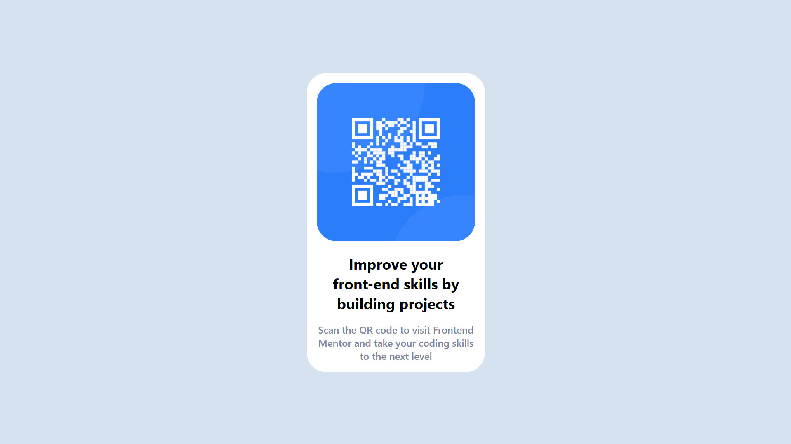

## Table of contents

- [Overview](#overview)
  - [Screenshot](#screenshot)
- [My process](#my-process)
  - [Built with](#built-with)
  - [What I learned](#what-i-learned)
  - [Continued development](#continued-development)
  - [Useful resources](#useful-resources)
- [Author](#author)
- [Acknowledgments](#acknowledgments)

## Overview

I completed this project to practice using Git and GitHub. Additionally, I wanted to work with some basic CSS and make it responsive. Through this project, I gained valuable experience in version control and web development, which I can use in future projects. Overall, it was a great learning opportunity and a fun challenge to improve my skills.

Il s'agit d'un travail ayant pour but de pratiquer les outils tels que git et github. J'ai choisis un petit projet me permettant de pratiquant également du CSS et HTML. Durant le projet j'ai pu apprendre à faire du petit versioning de projet. 

https://kalem8.github.io/qr-code-component-main/

### Screenshot

## My process

The process of creating this project was done step by step, with the influence of atomic design. I began by managing the smallest indivisible parts such as paragraphs and titles, and built the rest of the project on top of them.

### Built with

- CSS custom properties
- CSS Grid
- Mobile-first workflow
- chat GPT

### What I learned

I learned the Git process (staging => commit => push), as well as the importance of creating branches and working on them to avoid any issues with the main branch. I also learned how to use all of the essential Git commands. However, I realize that there is still a lot for me to learn.

I enjoyed working with as little CSS as possible, which was made possible by creating a well-structured HTML and utilizing atomic design principles.

### Continued development

I plan to continue creating components like this for my own future use.

### Useful resources

- [Center stuff in CSS](https://www.youtube.com/watch?v=5kU3xE0AinM&t=508s) - This helped me for grid part. I really liked this pattern and will use it going forward.
- [Atomic design conference](https://www.youtube.com/watch?v=W-h1FtNYim4) - This is an amazing conference which helped me finally understand how to build CSS from 0. I'd recommend it to anyone still learning this concept.

## Author

- Youtube chanel- [Yunus Yildiz](https://www.youtube.com/channel/UCHcbGs0_a6xnTPpbkoRaGuw) (Maybe I'll produce some dev stuff on it)
- Linkedin - https://www.linkedin.com/in/yunus-yildiz-b919b7206/

## Acknowledgments

Thank to chat GPT !
